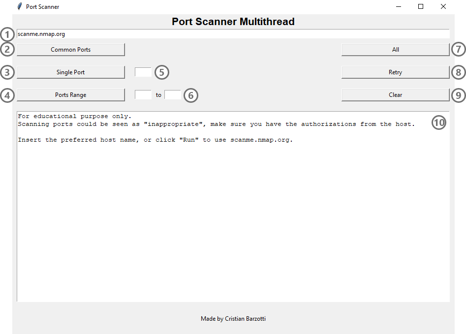

# python-port-scanner

Simple port scanner using Python, with a built-in GUI.

## GUI Walkthrough

1- Search bar, accept both host name or IP adress

2- Scan all common ports (well known and registered)

3- Scan a single port

4- Scan a range of ports

5- Single port insertion bar

6- Ports range insertion bar

7- Scan all ports

8- Retry scan for ports with no answer

9- Clear button for the answers window

10- Answers window
